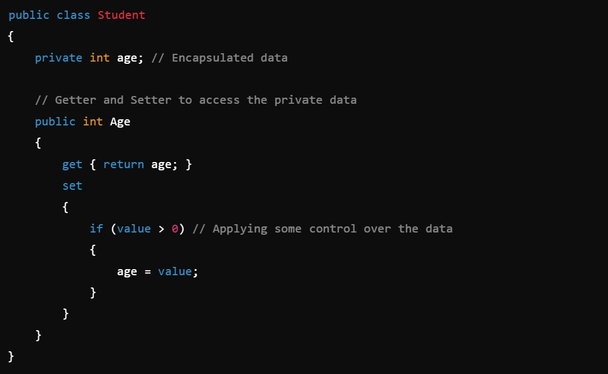
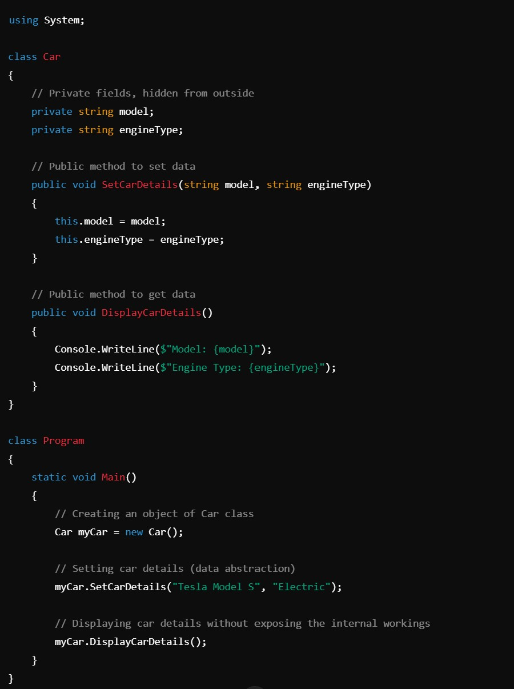
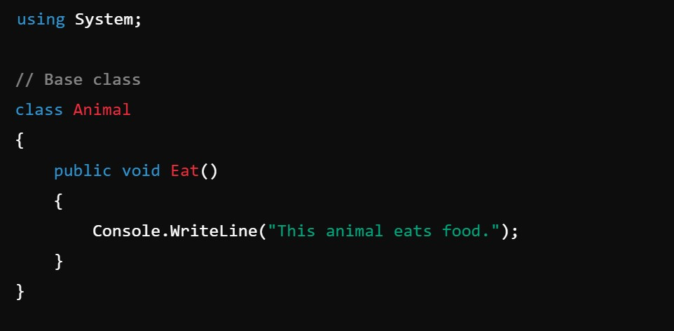
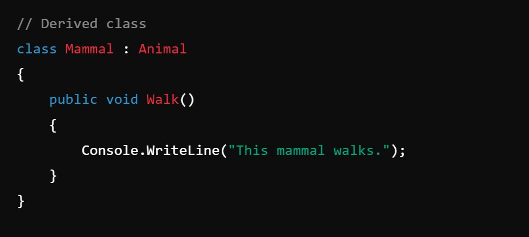
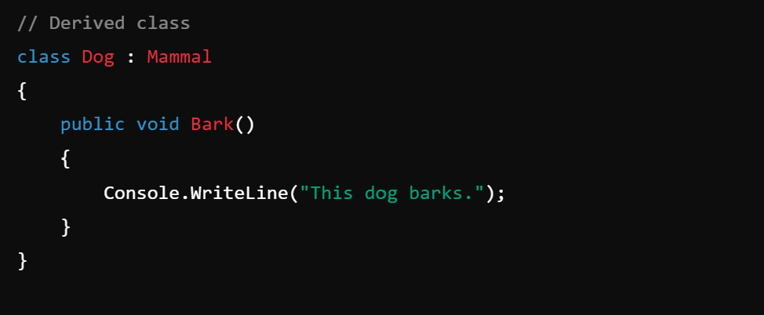
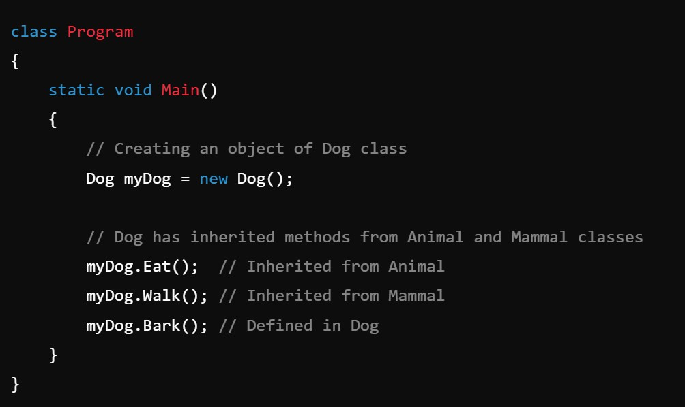
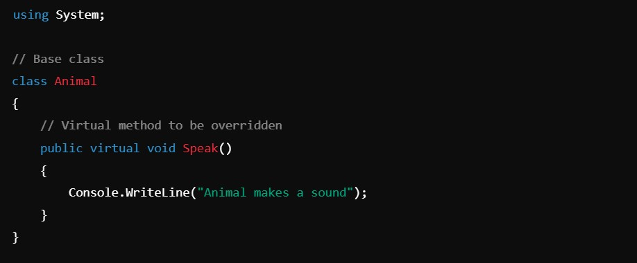
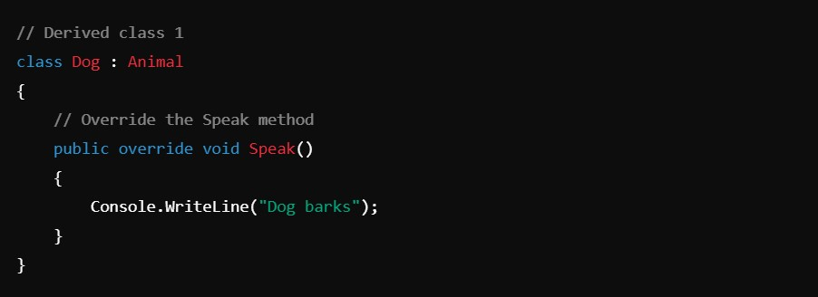
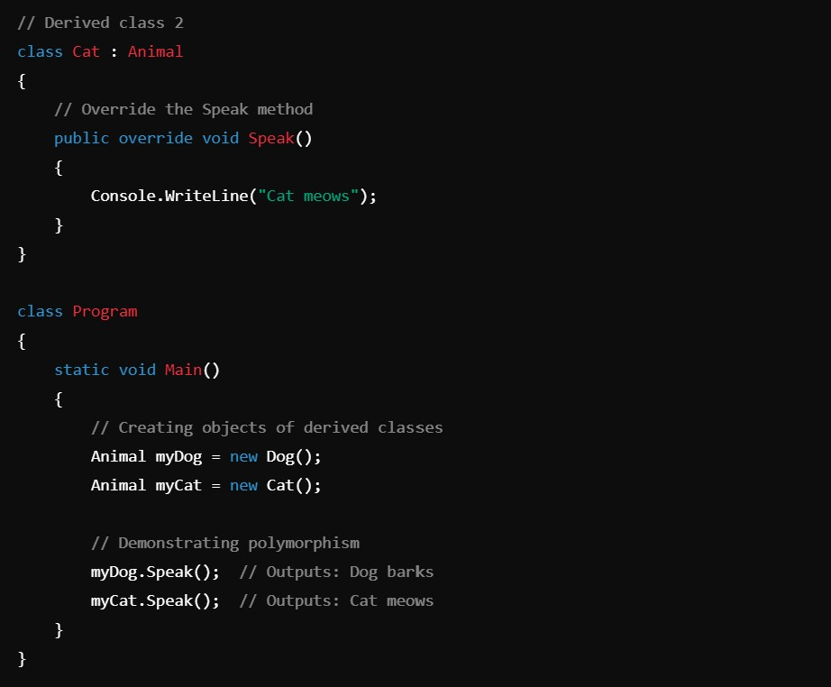

# Object Oriented Programming (OOP)

**_The basic OOP concept has 4 types._**

- Encapsulation
- Abstraction
- Inheritance
- Polymorphism

*--------------------------------------------------------------------------*

### **Encapsulation:**

Encapsulation is defined as wrapping up data and information under a single unit to manipulate them.

In this example, the age attribute is private, and we manipulate it using the public property Age, ensuring that only valid values can be assigned to age.

*--------------------------------------------------------------------------*

### **Abstraction:**

Data Abstraction refers to providing only essential information to the outside world and hiding the background details, i.e., representing the needed information in the program without presenting the details.
#### Example: *public*, *private*, *protected*

Explanation:
- Data Abstraction is achieved by hiding the internal details of the Car class (such as the model and engineType fields) from the outside world.
- The user interacts with the car through the SetCarDetails and DisplayCarDetails methods, which are the essential operations the user needs to know about, without needing to access or understand the internal fields directly.

*--------------------------------------------------------------------------*

### **Inheritance:**

Inheritance allows us to define a class in terms of another class, which makes it easier to create and maintain an application. This also provides an opportunity to reuse code functionality and reduces implementation time. The existing class is called the base class, and the new class is referred to as the derived class.

##### Class Derived Class:
Access specifier base class. The idea of inheritance implements the is a relationship. 
_For example, a mammal is an animal, a dog is a mammal, hence a dog is an animal as well, and so on._

Explanation:
- The Animal class is the base class with the Eat() method.
- The Mammal class inherits from Animal and adds a Walk() method.
- The Dog class inherits from Mammal and adds a Bark() method.

This demonstrates the "is-a" relationship:
- A Dog "is-a" Mammal (because Dog inherits from Mammal).
- A Mammal "is-a" Animal (because Mammal inherits from Animal). 
*So, Dog "is-a" Animal as well!*

*--------------------------------------------------------------------------*

### **Polymorphism:**

The word polymorphism means having many forms. Typically, polymorphism occurs when there is a hierarchy of classes, and they are related by inheritance.
#### Example: *Function overloading*, *Function overriding*

Explanation:
- The Speak method is defined in the Animal base class as a virtual method.
- Dog and Cat classes override this method to provide their own implementation.
- In the Main method, the same method Speak is called on both myDog and myCat, but the output differs based on the actual object type, demonstrating polymorphism.
- This is polymorphism in action: the same method name behaves differently depending on the object calling it.

*--------------------------------------------------------------------------*

